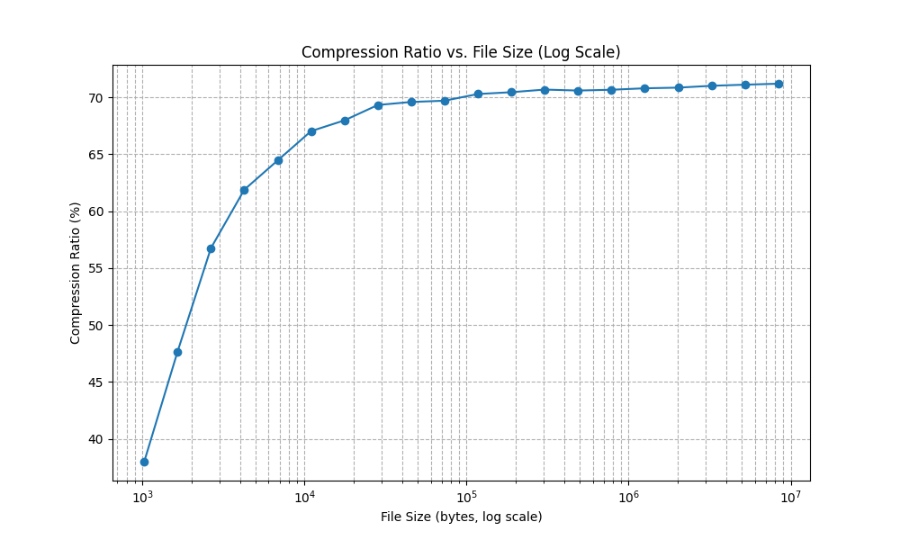

# Bzip2 Implementation

This project is a C++ implementation of the Bzip2 compression algorithm. The implementation includes both the encoder and decoder for compressing and decompressing files. The encoder compresses a file using Burrows-Wheeler Transform (BWT), Move-to-Front Transform (MTF), Run-Length Encoding (RLE), and Huffman coding. The decoder reverses these transformations to restore the original file.

## Bzip2 Algorithm Overview

Bzip2 is a block-sorting file compressor that uses a combination of the Burrows-Wheeler Transform, Move-to-Front Transform, Run-Length Encoding, and Huffman Coding to compress data. Here’s a brief overview of each step:

- **Burrows-Wheeler Transform (BWT)**: Rearranges the input text to group similar characters together, which is more favorable for subsequent compression steps.
- **Move-to-Front (MTF) Transform**: Converts the sequence of characters into a sequence of indices, which tends to produce many zeros and small numbers when used after BWT.
- **Run-Length Encoding (RLE)**: Encodes runs of the same value into a single value and a count, reducing repetitive sequences to smaller representations.
- **Huffman Coding**: Compresses the final sequence of symbols into a binary format, where more frequent symbols have shorter codes.

For more detailed information about the Bzip2 algorithm, you can visit the [wikipedia page](https://en.wikipedia.org/wiki/Bzip2).

## Preformance

The following table illustrates the performance of this Bzip2 implementation on sample data generated using Lorem Ipsum:

| Original Size      | Compressed Size      | Compression Ratio | Space Savings (%) |
|--------------------|----------------------|-------------------|-------------------|
| 1 KB               | 628 Bytes            | 0.613             | 38.7%             |
| 10 KB              | 3.4 KB               | 0.340             | 66.0%             |
| 100 KB             | 30 KB                | 0.300             | 70.0%             |
| 1,000 MB           | 292 KB               | 0.292             | 70.8%             |
| 10,000 MB          | 2.8 MB               | 0.280             | 72.0%             |

The graph shows the compression ratio at different file sizes, with the ratio stabilizing around 72%:


## Usage

### Build

Run `make` to compile the project, creating `bzip2_compress` and `bzip2_decompress` executables.

### Encoding

To compress a file, use the command:

```bash
./bzip2_compress <input_file>
```

### Decoding

To decompress a file, use the command:

```bash
./bzip2_decompress <compressed_file>
```

Adds the `._bz2` extension to the compressed file name.

## File Structure

The project directory is structured as follows:

``` plaintext
.
├── Makefile
├── README.md
├── decoder.cpp
├── encoder.cpp
├── inc
│   ├── burrows_wheeler.h
│   ├── huffman.h
│   ├── move_to_front.h
│   ├── run_length_encoding.h
│   ├── transform.h
│   └── utils.h
└── src
    ├── burrows_wheeler.cpp
    ├── huffman.cpp
    ├── move_to_front.cpp
    ├── run_length_encoding.cpp
    └── utils.cpp

```
